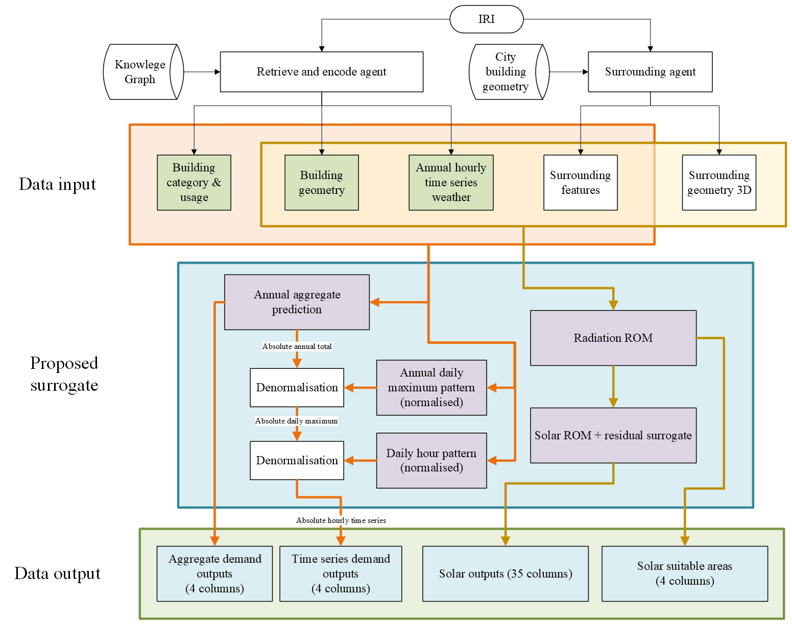

# Surrogate Bundle

[toc]

## Interfaces



### main.py

surrogate(

​		IRI_lst: list, 	**# BUILDING IRI, NOT UUID of timeseries table, cannot be copied from KS adminer file names, see target_mapping.csv**

​		geometry_loc: str, 

​		usage_loc: str,

​		flag: int = 4

) -> surrogate_results

```python
@dataclass
class surrogate_result:
    flag: int
    IRIs: list[str]
    aggregate_demand: pandas.DataFrame | None = None
    timeseries_demand: pandas.DataFrame | None = None
    timeseries_solar_tech: pandas.DataFrame | None = None
    solar_suitable_areas: pandas.DataFrame | None = None
    error_metrics: dict
```

| Flag value | Prediction mode                               |
| ---------- | --------------------------------------------- |
| 1          | Demand-only aggregate prediction              |
| 2          | Demand-only time series prediction            |
| 3          | Solar technologies-only timeseries prediction |
| 4          | Comprehensive prediction                      |


* save_timeseries_results(surrogate_results, output = True) -> pandas.DataFrame [8760, 39, buildings]

Return 39-col DataFrame, and save results to \Outputs as one 39 column csv file `building_{timeseriesUUID}.csv` per building when output = True.


* save_static_results(surrogate_results, output = True) -> pandas.DataFrame [buildings, 9]

Return  DataFrame, and save results to \Outputs as `building_scalar.csv` when output = True.


* save_error(surrogate_results, label:str, output = True) -> pandas.DataFrame [buildings, 8]

Return  DataFrame, and save prediction error comparing to target to \Outputs as `prediction_error_{label}.csv` when output = True.

scheme: Grid MAE, Grid RAE, Grid MAPE, Grid NMAE, Heating MAE, Heating RAE, Heating MAPE, Heating NMAE


### weather_mapper.py

mapweather(

​	building_IRI: str,

​	geometry_csv: str

) = weather_IRI -> str


```python
from Scripts.weather_mapper import mapweather

weather_iri = mapweather(
    building_IRI,
    geometry_csv,
)
```

Finds the nearest weather building IRI, which can then be used to map the corresponding .csv in \data


### surrounding_agent.py

get_surrounding_features(

- building_uuid_or_iri -> str,
- plot_geometries -> bool = False,
- geometry_csv -> str | Path,
- cell_size_m -> float = 50.0,
- radius_m -> float = 50.0,
- index_path -> str | Path | None = None,
- print_neighbours -> bool = False,
- include_neighbour_uuids -> bool = False,
- revert_old -> bool = False

) -> dict

```python
from Scripts.surrounding_agent import get_surrounding_features

features = get_surrounding_features(
    building_uuid_or_iri=(
        "https://theworldavatar.io/kg/Building/"
        "9a5bf5e2-b8c2-4ac5-ab73-02d72a678de7"
    ),
    geometry_csv=r"data\building_geometry_full.csv",
    radius_m=50.0,
    index_path=r"Scripts\building_geometry_full_grid_index_50m.json",
)
```

Finds neighbouring buildings by centroid distance and returns geometry-derived surrounding features.

Default output:

```python
num_neighbours_50m
density_50m
max_height_50m
mean_height_50m
nearest_taller_distance

north_obstruction_angle
south_obstruction_angle
east_obstruction_angle
west_obstruction_angle
roof_obstruction_proxy

north_wall_coverage_ratio
south_wall_coverage_ratio
east_wall_coverage_ratio
west_wall_coverage_ratio
```

Optional behaviour:

```python
include_neighbour_uuids=True
    Adds neighbour_uuids_50m to the returned dict.

print_neighbours=True
    Prints neighbouring building UUIDs.

plot_geometries=True
    Opens a 3D target-and-neighbour geometry plot.

revert_old=True
    Returns only the original 10 surrounding features.
```

Neighbours are selected using:

```
centroid distance <= radius_m
```

------

get_directional_surface_areas(

- building_uuid_or_iri -> str,
- geometry_csv -> str | Path,
- cell_size_m -> float = 50.0,
- index_path -> str | Path | None = None

) -> dict[str, float]

```python
from Scripts.surrounding_agent import get_directional_surface_areas

areas = get_directional_surface_areas(
    building_uuid_or_iri=building_IRI,
    geometry_csv=r"data\building_geometry_full.csv",
    index_path=r"Scripts\building_geometry_full_grid_index_50m.json",
)
```

Returns roof and cardinal façade areas:

```
roof_area_m2
north_facade_area_m2
south_facade_area_m2
east_facade_area_m2
west_facade_area_m2
```

The output follows the solar model’s surface convention:

```
R, N, S, E, W
```

------

build_grid_index(

- geometry_csv -> str | Path,
- cell_size_m -> float = 50.0,
- index_path -> str | Path | None = None,
- force -> bool = False

) -> Path

```python
from Scripts.surrounding_agent import build_grid_index

index_path = build_grid_index(
    geometry_csv=r"data\building_geometry_full.csv",
    cell_size_m=50.0,
    index_path=r"Scripts\building_geometry_full_grid_index_50m.json",
)
```

One-off function, builds and caches the spatial grid index used by the surrounding-feature interfaces, reducing future computational complexity to O(1). Existing indexes are reused unless `force=True`.


### demand_input_agent.py

 demand_input(

​		IRI_lst: list,

​		weather_IRI: str, 

​		geometry_loc: str, 

​		usage_loc: str

) = static_input -> DataFrame, timeseries_input -> DataFrame


```python
from Scripts.demand_input_agent import demand_input

static_input, timeseries_input = demand_input(
    IRI_lst=[
        "https://theworldavatar.io/kg/Building/9a5bf5e2-b8c2-4ac5-ab73-02d72a678de7"
    ],
    weather_IRI=(
        "https://www.theworldavatar.com/kg/ontoems/"
        "ReportingStation_b9e3aa38-d6ea-47e4-81dc-c3d0dffdd4d2"
    ),
    geometry_loc=r"THESIS\City data\Kaiserslautern\adminer\Minorities\building_geometry_full.csv",
    usage_loc=r"THESIS\City data\Kaiserslautern\adminer\Minorities\building_usage.csv",
)
```

```python
static_input.shape     = (35, 1)
timeseries_input.shape = (52, 8760)

static_input:
5 geometry + 20 usage + 10 surrounding = 35

timeseries_input:
11 weather + 6 temporal + 20 usage
+ 10 surrounding + 5 geometry = 52
```

Retrieve and encode the input accepted by ML models, calling get_surrounding_features() and mapweather()


### demand_pipline.py

static_output, timeseries_output = demand_surrogate(
    demand_input(
        IRI_lst,			 
        weather_IRI,
        geometry_loc,
        usage_loc,
    )
) = static_demand_output -> DataFrame, timeseries_demand_output -> DataFrame


Calc chain:

```
Annual total prediction × Daily maximum shape × CNN 24h hourly maximum shape
```

Output order

```
GridConsumption
ElectricityConsumption       # copying Grid
HeatingConsumption
CoolingConsumption           # always 0 for Germany
```


### radiation_ROM.py

The reduced order model deliberately reduces a building to five receiving surfaces (roof, north, south, east and west) and calculates the hourly radiation on these facades.  pvlib transposes hourly DNI/DHI to each plane, Embree tests direct-sun visibility against extruded neighbouring footprints, and a small cosine-weighted hemisphere sample estimates diffuse sky view.

Core function:

```python
calculate_radiation(
    building_IRI: str,
    geometry_csv: str,
    weather_IRI: str, 
    radius_m: float = 50.0,
    sky_rays: int = 256,
    albedo: float = 0.2,
    index_path -> Path | None = None,
    solar_time_offset_minutes: float = 30.0,
    hourly_threshold_Whm2: float = 50.0,
    annual_threshold_kWhm2: float = 800.0,
    wwr: float = 0.16,
    roof_grid: float = 10.0,
    walls_grid: float = 200.0,
    max_roof_sensors: int = 256,
    max_wall_sensors: int = 128,
) -> tuple[pandas.DataFrame, dict]
```

```python
from solar.radiation_ROM import calculate_radiation

radiation, metadata = calculate_radiation(
    building_uuid="building UUID or IRI",
    geometry_csv= "building_geometry_full.csv",
    weather_IRI= "https://www.theworldavatar.com/kg/ontoems/ReportingStation_b9e3aa38-d6ea-47e4-81dc-c3d0dffdd4d2"
)
```


### solartech_ROM.py

Calculates 5 directions of 7 technology outputs from accepted radiation results and weather data. Default solar collector parameters uses CEA Sweden database. 

```python
convert(
    radiation_kw: numpy.ndarray,
    area_m2: numpy.ndarray,
    ambient_c: numpy.ndarray,
    absorption_ratio: numpy.ndarray,
    apply_aggregate_annual_filter: bool,
) -> numpy.ndarray
```

Input shape:

```
radiation_kw     [building, hour, 5]
area_m2          [building, 5]
ambient_c        [hour]
absorption_ratio [hour, 5]
```

Order of the 5 direction inputs:

```
R, N, S, E, W
```

Output shape:

```
[building, hour, 35]
```

Order of the 7 technology types:

```
PV, ET_Q, ET_E, FP_Q, FP_E, Th_ET, Th_FP
```

```python
from solar.solartech_ROM import (
    convert,
    pv_absorption_ratio,
)

absorption = pv_absorption_ratio() # Sweden parameters

solar_output = convert(
    radiation_kw=radiation_kw,
    area_m2=area_m2,
    ambient_c=ambient_temperature,
    absorption_ratio=absorption,
    apply_aggregate_annual_filter=True,
)
```


### solar_pipline.py

Surrogate worflow on the solar side

schema:

```python
ORIENTATIONS = ("R", "N", "S", "E", "W")

TECHNOLOGIES = (
    "PV",
    "ET_Q",
    "ET_E",
    "FP_Q",
    "FP_E",
    "Th_ET",
    "Th_FP",
)
```


```python
@dataclass
class SolarInput:
    building_iri: str
    building_uuid: str
    timestamps: pd.DatetimeIndex
    weather: pd.DataFrame
    target_geometry: BuildingGeometry
    neighbour_geometries: list[BuildingGeometry]

@dataclass
class RadiationResult:
    raw_Whm2: np.ndarray             # [8760, 5]
    filtered_Whm2: np.ndarray        # [8760, 5]
    filtered_kW: np.ndarray          # [8760, 5]
    gross_area_m2: np.ndarray        # [5]
    opaque_area_m2: np.ndarray       # [5]
    eligible_area_m2: np.ndarray     # [5]
    metadata: dict

@dataclass
class SolarResult:
    values: np.ndarray               # [8760, 7, 5]
    suitable_areas_m2: dict[str, float]
```

Core function:

```python
def solar_surrogate(
    
    building_iris: list[str],
    geometry_loc: str | Path,
    weather_dir: str | Path | None = None,
    index_path: str | Path | None = None,
    radius_m: float = 50.0,

) -> tuple[pd.DataFrame, pd.DataFrame]:
    """
    Returns:
        timeseries_solar_tech 35 * 8760
        solar_suitable_areas 5*1
    """
```


## Environment

```
Python 3.12
scikit-learn 1.8
NumPy 2.x
PyTorch 2.13 CPU
```


## Batch prediction

Run Python from the `Final_bundle` directory and pass all required **building IRIs** to `Scripts.main.surrogate` (do not use the time-series table UUIDs found in Adminer filenames). Each building is automatically matched to its nearest weather station. For a large demand-only run, use `flag=1` for annual results or `flag=2` for 8,760-hour results; use `flag=4` only when demand and all solar outputs are required.

```python
from Scripts.main import surrogate, save_static_results, save_timeseries_results

building_iris = [
    "https://theworldavatar.io/kg/Building/9a5bf5e2-b8c2-4ac5-ab73-02d72a678de7",
    "https://theworldavatar.io/kg/Building/a6663731-7fc9-4c92-a603-8892b75366c2",
    # ...add the remaining buildings here
]

results = surrogate(
    IRI_lst=building_iris,
    geometry_loc=r"data\building_geometry_full.csv",
    usage_loc=r"data\building_usage.csv",
    flag=4,
)

static_df = save_static_results(results, output=True)
timeseries_df = save_timeseries_results(results, output=True)
```

With `output=True`, annual/static results are written to `Outputs\building_scalar.csv`; time-series results are written as one 39-column `Outputs\building_{timeseriesUUID}.csv` file per building. Set `output=False` to return the combined DataFrames without writing files. `target_mapping.csv` must contain every requested building UUID when time-series files are saved.


# todo


Bad targets: a lot of transposed files

need a residual model for solar

 separate the grid and heating models to acheive better performances 
